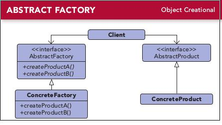

# 第四章 抽象工厂模式(AbstractFactory Pattern)
---

### 定义:
> 提供一个接口，用于创建相关或依赖对象的家族，而不需要指定具体类.

### 设计原则:
- 要依赖抽象，不要依赖具体类  依赖倒置原则[Dependency Inversion Principle];

---

### 缘由与思考:

抽象工厂允许客户使用抽象的接口来创造一组相关的产品，而不需要知道（或关心）实际产出的具体产品是什么。这样一来，客户就从具体的产品中被解耦。  

抽象工厂模式 vs 工厂方法模式  

- 工厂通过继承来创建对象，而抽象工厂使用组合
- 抽象工厂创建一组相关产品， 而工厂方法创建一个产品
- 一般来说，抽象工厂实现的时接口，而工厂继承抽象类。

---

