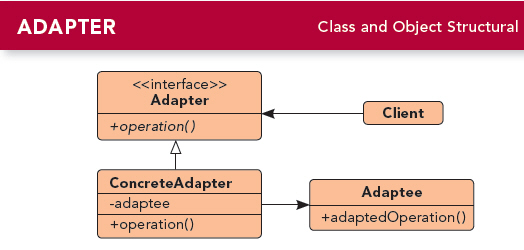

# 第七章 适配器模式(Adapter Pattern)
---

### 定义:
> 将一个类的接口，转换成客户期望的另一个接口.适配器让原本接口不兼容的类可以合作无间.

---

### 缘由与思考:

这个模式可以通过创建适配器进行接口转换，让不兼容的接口变成兼容。  

其实有两种适配器，本文的是对象适配器，通过组合模式，另一种是类适配器，通过多重继承两个不兼容的接口来达到适配目的，由于Java不支持多重继承，所以在Java中只有对象适配器。  
至于两者的优缺点，对象适配器可以适配该类的任何之类，有弹性，而类适配器最大的优点是不需要实现整个被适配者，必要的时候，可以覆盖被适配者的行为，因为其利用的继承，有效率。

适配器模式 vs 装饰者模式 vs 外观模式

- 适配器模式:     将一个接口转换成另一个接口
- 装饰者模式:     不改变接口，但加入职责
- 外观模式:       让接口更简单

---

