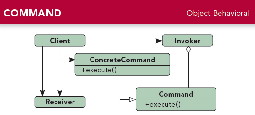

# 第六章 命令模式(Command Pattern)
---

### 定义:
> 将“请求”封装成对象，以便使用不同的请求、队列或者日志来参数化其他对象。命令模式也支持可撤销的操作.

---

### 缘由与思考:
开始如果请求者（调用者）直接调用接受者来执行动作，这样就会导致调用者和很多接受者耦合，而且每次有新的变化都要在主要类里修改。  
使用命令模式后可以达到调用者和接受者解耦。调用者依赖Command这个类，而不管有多少的接受者。

---

