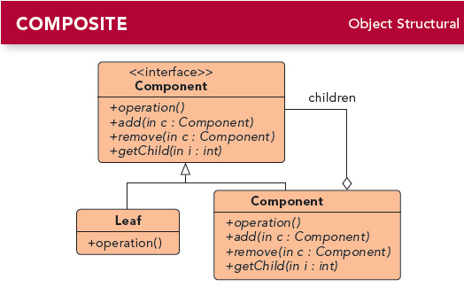

# 第九章 组合模式(Composite Pattern)
---

### 定义:
> 允许你将对象组合成树形结构来表现“整体/部分”层次结构.组合能让客户以一致的方式处理个别对象以及对象组合.

**组合模式和“多用组合，少用继承”中的组合不是一个概念**

---

### 缘由与思考:

当涉及“整体/部分”时，组合模式让我们能用树形方式创建对象的结构，树里面包含了组合以及个别的对象。并且我们能用统一的方式处理组合和个别对象。

组合模式是违反单一职责原则的，它即让有组合的职责和个别对象的职责，但它带来了一致性的处理方式（即透明性），所以在实现组合模式时，有许多设计上的折衷。要根据需求来平衡透明性和安全性的问题。

至于组合和个别对象里面一些无意义的方法，可以返回null或false或抛出异常来处理。

Android中的View与ViewGroup是典型的组合模式，叶子是各种控件。

---

