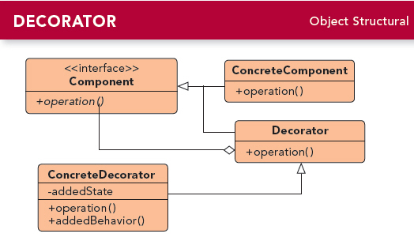

# 第三章 装饰者模式(Decorator Pattern)
---

### 定义:
> 动态地将责任附加到对象上,若要扩展功能,装饰者提供了比继承更有弹性的替代方案.

### 设计原则:
- 类应该对扩展开放,对修改关闭;

---

### 缘由与思考:
开始星巴克的产品都继承于Beverage饮品这个父类。  
如果各种调料和咖啡相互组合，将有太多太多的类。  

如果将各种调味料放在Beverage类中，有hasXXX调料，计算价格的时候去判断然后将各种调料价格计算。  
如果有新的调料，或调料价格变动等都需要修改类，而原则上应该对修改关闭，对增加开放。
况且如果多份调料呢，以及很多饮品可能不需要一些调料，例如茶不需要奶泡，这就导致继承了很多不合适方法。  

---

