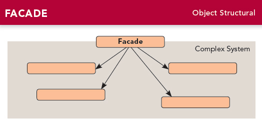

# 第七章 外观模式(Facade Pattern)
---

### 定义:
> 提供了一个统一的接口，用来访问子系统中的一群接口.外观定义了一个高层接口，让子系统更容易使用.

### 设计原则:
最少知识（Least Knowledge）原则: 只和你的密友谈话. 也叫得墨忒耳法则（Law of Demeter）.

---

### 缘由与思考:

外观模式简化了接口，并且将用户从组件复杂的子系统中解耦。  

最少知识原则希望我们在设计中，不要让太多的类耦合在一起。为了达到尽量小的耦合，我们只应该调用属于以下范围的方法：

- 该对象本身
- 被当做方法参数而传进来的对象
- 此方法所创建或实例化的任何对象
- 对象的任何组件

适配器模式 vs 装饰者模式 vs 外观模式

- 适配器模式:     将一个接口转换成另一个接口
- 装饰者模式:     不改变接口，但加入职责
- 外观模式:       让接口更简单

---

