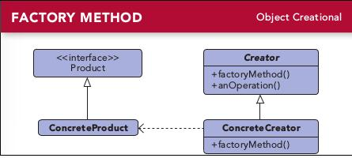

# 第四章 工厂方法模式
---

### 定义:
> 定义了一个创建对象的接口，但由子类决定要实例化的类是哪一个，工厂方法让类把实例化推迟到之类.

### 设计原则:
- 要依赖抽象，不要依赖具体类  依赖倒置原则[Dependency Inversion Principle];

---

### 缘由与思考:

这里注意和简单工厂方法的区别，简单工厂其实不是一个设计模式，反而比较像是一种编程习惯。

    Class PizzaStore {
        SimpleFactory factory;
        public PizzaStore(SimpleFactory factory) {
            this.factory = factory;
        }
        
        public Pizza orderPizza(String type) {
            return factory.createPizza(type); //简单工厂
        }
    }

开始的时候我们把各种pizza都放到PizzaStore类中，用if else来区分。  
但由于pizza种类这块时变化点，所以每次改变都要变更PizzaStore类，而且PizzaStore类依赖各种pizza类。  
所以要将变化各类，而且减少PizzaStore的依赖数目。  
所以可以用简单工厂来解决，如上代码。 

如果有多个PizzaStore店，他们局限于PizzaStore类，同时又各自有自己的区域风味。就可以用工厂方法。  

为什么叫依赖倒置  
通常情况下 PizzaStore[高层组件] 要依赖于各种pizza具体类 [底层组件],这叫向下依赖.    
而通过使用工厂方法后， pizza具体类依赖于Pizza抽象接口， PizzaStore也依赖于Pizza抽象接口，这就导致大家都依赖更高级的抽象.
> 所谓“高层”组件，是由其他"底层"组件定义其行为的类. 

---

