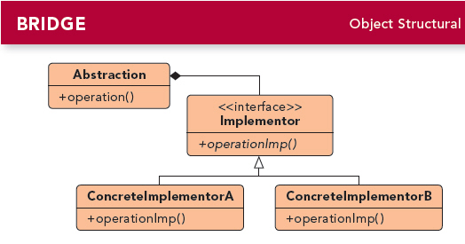
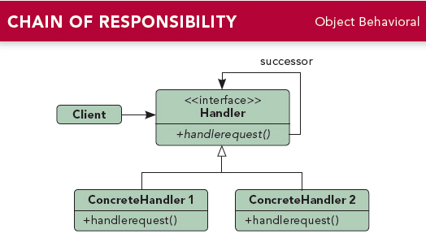
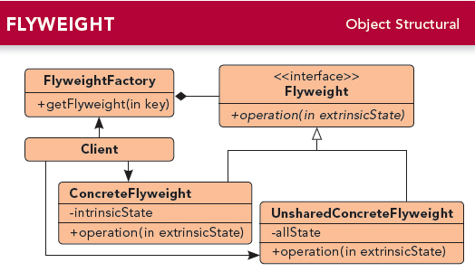
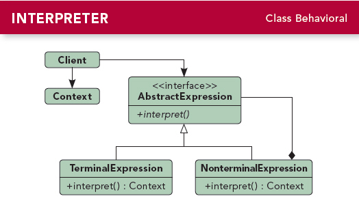
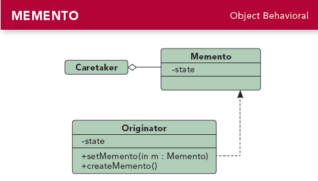
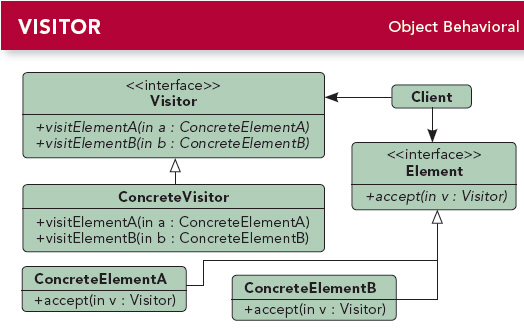

# 附录A 剩下的模式(Other Patterns)
---

### 定义:
> 桥接模式[Bridge Pattern]：不只改变你的实现，也改变你的抽象.

### 设计原则:
> 抽象和实现可以独立扩展，不会影响到对方.

---

### 定义:
> 生成器模式[Builder Pattern]：封装一个产品的构造过程，并允许按步骤构造.

### 设计原则:
> 允许对象通过多个步骤来创建，并且可以改变过程，并且将复杂的创建过程封装起来.

     
---

### 定义:
> 责任链模式[Chain of Responsibility Pattern]：当你想让一个以上的对象有机会能够处理某个请求的时候，就使用责任链模式.

### 设计原则:
> 将发送者和接收者解耦，经常被使用在窗口系统中，处理鼠标和键盘之类的事情.

---

### 定义:
> 蝇量模式[Flyweight Pattern]：让某个类的一个实例能提供许多“虚拟实例”.

### 设计原则:
> 减少运行时对象实例的个数，节省内存.将许多“虚拟”对象的状态集中管理

---

### 定义:
> 解释器模式[Interpreter Pattern]：为语言创建解释器.

### 设计原则:
> 当需要实现一个简单的语言时，使用解释器

---

### 定义:
> 中介者模式[Mediator Pattern]：用来集中相关对象之间复杂的沟通和控制方式.

### 设计原则:
> 通过将对象彼此解耦，可以增加对象的复用性.将控制逻辑集中，简化系统的维护.  
中介者常常用来协调相关的GUI组件.

---

### 定义:
> 备忘录模式[Memento Pattern]：用来记录之前状态.

### 设计原则:
> 保持关键对象的数据封装和容易实现的恢复能力，帮助维护内聚.

---

### 定义:
> 原型模式[Prototype Pattern]：用于当创建给定类的实例的过程很昂贵或复杂时.

### 设计原则:
> 在一个复杂的类层次中，当系统必须从其中许多类型创建新对象时，可以考虑原型.  
其向客户隐藏制造新实例的复杂性.

---

### 定义:
> 访问者模式[Visitor Pattern]：当你想要为一个对象的组合增加新功能，且封装并不重要的时候.

### 设计原则:
> 允许你对组合结构加入新的操作，而无需改变结构本身，虽然添加新的操作简单，但会打破组合类的封装，因为游走功能牵涉其中，所以对组合结构的改变就更加困难.

     