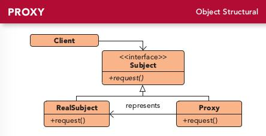

# 第十一章 代理模式(Proxy Pattern)
---

### 定义:
> 为另一个对象提供一个替身或占位符以控制对这个对象的访问.

---

### 缘由与思考:
使用代理模式创建代表对象，让代表对象控制某对象的访问，被代理的对象可以是远程的对象，创建开销大的对象或需要安全控制的对象等。

代理的常见类型：

- 远程代理：远程代理可以作为另一个JVM[不止这些]上对象的代表.
- 虚拟代理：虚拟代理作为创建开销大的对象的代表。虚拟代理经常直到我们真正需要一个对象的时候才创建它。当对象创建前和创建中时，有虚拟代理扮演对象的替身，对象创建后，代理就会将请求直接委托给对象处理。
- 防火墙代理：控制网络资源的访问，保护主题免于“坏客户”的侵害.
- 缓存代理：为开销大的运算结果提供暂时存储，它也允许多个客户端共享结果，以减小计算或网络的延迟.
- 智能引用代理：当主题被引用时，进行额外的动作，例如计算一个对象被引用的次数.
- 同步代理：在多线程的情况下为主题提供安全的访问.
- 复杂隐藏代理：用来隐藏一个类复杂集合的复杂度，并进行访问控制.有时候也称外观代理，这不难理解.复杂隐藏代理和外观模式是不一样的，因为代理控制访问，而外观模式提供另一组接口.
- 写入时复制代理：用来控制对象的复制，方法时延迟对象的复制，知道用户真正需要为止，这是虚拟代理的变体.

Java中java.lang.reflect包有自己的代理支持。由于实际的代理类时在运行时根据传入不同的参数而动态创建出来的，我们称这个技术为：动态代理.步骤如下:

- 创建InvocationHandler类的实现类，而这个类实现了代理的行为.
- 创建动态代理. (PersonBean) Proxy.newProxyInstance(person.getClass().getClassLoader(), person.getClass().getInterfaces(), new concreteInvocationHandler(person))
- 使用代理.

---

---

## Java远程方法调用（RMI [Remote Method Invocation]）

### 步骤一:制作远程接口
- 扩展java.rmi.Remote.Remote不具有方法，对于RMI来说只是一个记号接口.而接口扩展另一个接口用extends.
- 声明所有的方法都抛出RemoteException.因为底层用了网络和I/O，所以有发生异常的风险.
- 确定变量和返回值时属于原语（primitive）类型[基础类型和String和许多API内定的数组集合等类型]或者可序列化类型.

### 步骤二:制作远程实现
- 实现远程接口
- 扩展UnicastRemoteObject.为了成为远程服务对象，你的对象需要某些“远程的”功能，最简单的就是扩展java.rmi.server.UnicastRemoteObject,让超类帮你做这些工作.
- 设计一个不带变量的构造器，并抛出RemoteException.由于子类实例化的时候超类的构造器总会被调用.而UnicastRemoteObject的构造器都抛出了RemoteException异常.
- 用RMI Registry注册此服务.
    try{
        MyRemote service = new MyRemoteImpl();
        Naming.bind("rmi://xxx.xxx.xxx.xxx:xxxx[port]:RemoteHello[whatever name]", service)
        //Naming.rebind("rmi://xxx.xxx.xxx.xxx:xxxx[port]:RemoteHello[whatever name]", service)
    } catch(...)
    
### 步骤三:产生Stub和Skeleton [已不需要]
- 在远程实现类上执行rmic,命令:rmic MyRemoteImpl.  **现在已不需要生成骨架[1.2+]，而存根也已经动态生成给替换[5+]**

### 步骤四:执行remiregistry [已不需要]
- 命令:remiregistry.

### 步骤五:启动服务
- 命令:java MyRemoteImpl

### 步骤六:客户端接收
- 客户到RMI registry中寻找。 Naming.lookup("rmi://xxx.xxx.xxx.xxx:xxxx[port]:RemoteHello"）
- RMI registry返回Stub对象,强制转换.
- 调用stub方法，就像stub就是真正的服务对象一样
     