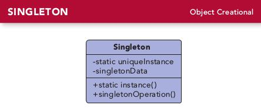

# 第五章 单例模式(Singleton Pattern)
---

### 定义:
> 确保一个类只有一个实例，并提供一个全局访问点.

---

### 缘由与思考:
首先很多时候我们希望有些对象只有一个，例如线程池，缓存，日志等。  
如果用全局变量来表示，那么在程序一开始就要创建对象，万一这个对象非常耗费资源，而程序在这次执行过程中又没有使用到，就会非常浪费。而且本质上说全局变量并不能保证对象的唯一性。  
而单例模式有全局变量的功能，又可以延迟实例化，并且能保证对象的唯一性。

单例模式要注意线程安全的问题：  

- SimpleSingleton是简单的懒汉式创建方式，线程不安全
- Singleton1加了同步，但由于即使已经实例化了，每次访问还是要同步，效率比较低，如果getInstance()造成的额外负担可接受，倒也可以。
- Singleton2直接用饿汉式创建方式，虽然线程安全了，但存在有没有被使用都要创建的缺点（正如全局变量一样）。
- Singleton3的双重检查枷锁方式在 java 5 以上可能是最优解。

但并不是做到线程安全就真的能保证单例只有一个对象，例如如果有多个类加载器，可能会创建多个单例对象，解决方案就是如果有多个类加载器，要自行指定类加载器，并指定同一个类加载器。

---

