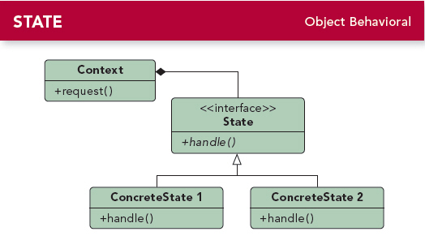

# 第十章 状态模式(State Pattern)
---

### 定义:
> 允许对象在内部状态改变时改变它的行为，对象看起来好像修改了它的类.

---

### 缘由与思考:

- 状态模式允许一个对象基于内部状态而拥有不同的行为。
- 状态模式把行为委托给当前状态而达到不同状态不同的类。
- 状态模式和策略模式有相同的类图，但它们的意图不同。
- 策略模式通常用行为或算法来配置Context类
- 状态模式允许Context随着状态改变而改变。就是前后动作或算法之间存在一定关系。
- 使用状态模式通常会导致设计中类的数目大量增加。

---

