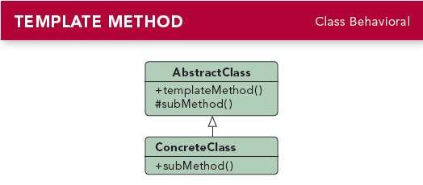

# 第八章 (Template method Pattern)
---

### 定义:
> 在一个方法中定义一个算法的骨架，而将一些步骤延迟到子类中.模板方法使得子类可以不改变算法结构的情况下，重新定义算法中的某些步骤.

### 设计原则:
> 好莱坞原则：别调用我们，我们会调用你.

好莱坞原则主要说高层组件对待底层组件的方式是“别调用我们，我们会调用你们”，防止相互调用而产生的“依赖腐败”。<相互依赖，依赖混乱，很难搞懂依赖关系>

---

### 缘由与思考:
开始的时候设计时茶和咖啡都继承于咖啡因饮料，每个方法都各自实现。  
一切算法都有子类主导，而且算法分散到很多类中，不好管理。  
有大量重复代码。
新的饮品类添加改动大。  

使用模板方法后，超累专注于算法本身，而子类可以提供自己的实现。  
超类可以对特定方法进行默认实现或空实现，这些成为钩子方法，子类可以选择覆盖或使用默认的方法处理。  
超类可以将不想子类改变的方法加final，例如算法骨架方法。  

Android中的模板方法经典例子就是onCreate(),onResume...这些周期方法.

现实中的模板方法可能并不是这么明显使用继承，例如Array.sort()的方法就实现了算法框架，而里面被排序类需要实现Comparable接口里面的compareTo具体的方法。所以也可以是模板方法。

模板方法模式 vs 策略模式 vs 工厂方法模式

- 模板方法模式：一般使用继承的方法，子类决定实现算法中的步骤。<子类实现算法框架的一部分>
- 策略模式：用组合方式，封装可互换的行为，然后使用委托来决定采用哪种行为。<替换整个算法>
- 工厂方法是一种特殊的模板方法。

---

